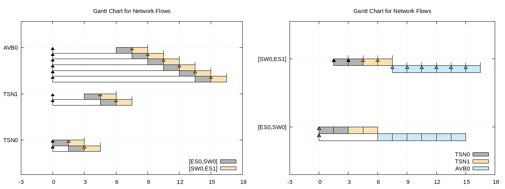
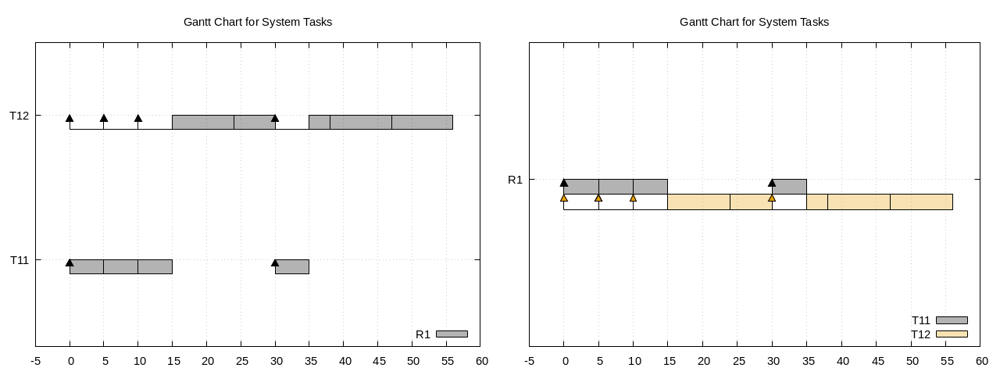

# gnuplot-gantt-chart

Gantt charts in Gnuplot. Visualization of network simulation, task scheduling, worst-case delay evaluation, etc.

## Intro

I've seen lots of Gantt charts (a.k.a. timeline charts, pipeline charts) appeared in papers from network/operation-system/industrial-tasks scheduling. Strangely, I cannot find one script generating Gantt charts for scheduling.

Most Gantt chart scripts are for project management, and thus lacking of the features I needed:

- X-axis in numbers instead of datetimes
- Packets of same flows/links displayed on same line
- Activation arrows to show the arrival times

Guess *everyone* generates Gantt charts on their own. So I wrote some Gnuplot scripts for these featues. Hope this repository saves you time, from searching solutions of this specific usage of Gantt charts.

To generate Gantt charts below, simply do this in repository directory.
```
$ make
```

## Data Format

The Gnuplot scripts handle both network and system scheduling. Consider their differences, I'll adopt terminologies in Network Calculus (NC) and Compositional Performance Analysis (CPA) here.

|Column|Type|Network Terminology|System Terminology|
|:----:|:--:|-------------------|------------------|
|1|`str`|flow name|task name|
|2|`int`|n-th instance of flow|n-th event of task
|(3)|`int`|n-th packet of instance|(none)
|4|`str`|link name|resource name
|(5)|`int`|priority of flow|priority of task
|6|`num`|arrival time of packet|activation time of event
|7|`num`|start time of packet transmission|start time of event execution|
|8|`num`|end time of packet transmission|end time of event execution|
|(9)|`num`|end time of packet traversal|end time of event path|

Columns 3, 5, 9 are optional; just fill them with zeros if any is absent.

## Explained in Network Scheduling

The data is `data/flowspan.data`. There are 3 flows named TSN0, TSN1 and AVB0 routed along the path [ES0, SW0, ES1]. All of them has 1 instance packetized and sent from ES0 at time 0.

We can see end-to-end delays of the instances are 4.5, 7.5 and 16.5 respectively, and AVB0 have no chance to block other high-prioirity flows in this case.



## Explained in System Scheduling

The data is `data/pycpa.data`, modified from Gantt chart example (in matplotlib) of [PyCPA][pycpa]. There are 2 tasks T11 and T12 executing on a preemptive resource R1. T11 has a burst of 3 events at time 0 and then 1 event at time 30, while T12 is a dependent task of T11.

We can see maximum delays of the events are 5 and 14 respectively, and 2nd event of T12 is preempted by 4th event of T11.



[pycpa]: https://pycpa.readthedocs.io/en/latest/
